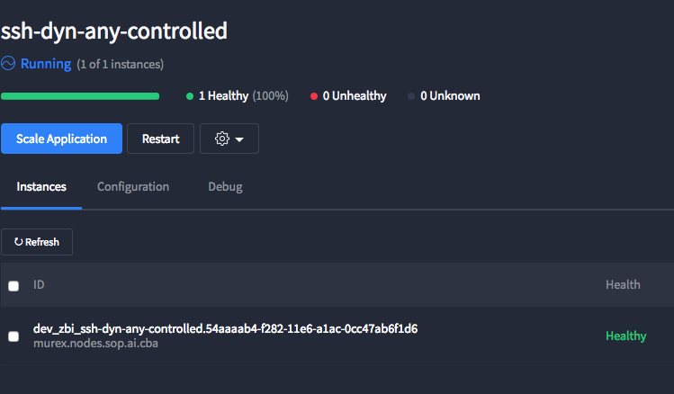

:title: Health Checks
:data-transition-duration: 1500
:css: site.css

----

Who am I?
============

Chris Kolenko | CBA Software Engineer
-------------------------------------

.. note::

    Talk about hobbies, family

----

Why am I presenting?
====================

* Mesos native health checks is new (1.1.0 - 1.2.0)

* Marathon Load Balancer

* Masters couldn't connect to workloads

.. note::

    Stephan asked if I was willing to give a presentation, since it was a new feature.

    I stubbled across this new feature trying to make Marathon LB work correctly for my App.

    When trying Marathon HTTP it didn't work (because of our network). Which was good because I didn't really know what it was going to do.

----

What is a health check?
=======================

In very simple terms it's a pass or fail test that runs every now and then to make sure something is passing.

.. note::

    I'll get to the framework limitations soon.

----

:data-rotate: 90

What type of health checks?
===========================

* HTTP/HTTPS

* TCP

* Command

.. note::

   HTTP/HTTPS like the internet
   
   TCP check if port is in use

   Command will run a command against inside the task

----

:data-rotate: 90

What are the important settings?
================================

* path (/api/health)

* protocol (HTTPS/HTTP)

* gracePeriodSeconds (300 seconds)

* intervalSeconds

* timeoutSeconds

* maxConsecutiveFailures

.. note::

   gracePeriodSeconds ignore failures until either success or after 300 secs

   intervalSeconds wait inbetween checks

   timeoutSeconds if reached == failed

   maxConsecutiveFailures number of fails in a row before TASK isn't health

----

:data-rotate: 90

Can I have multiple health checks?
==================================

YES!

.. note::

    Just here so no one has to ask

----

:data-rotate: 90

Why Mesos added native HC?
==========================

* Most frameworks where creating their own

* Frameworks had limitations

* Here's the doc: https://github.com/apache/mesos/blob/master/docs/health-checks.md

.. note::

    I'll get to the framework limitations soon.

----

:data-rotate: 90

Marathon Health Checks
======================

As of 1.4 Marathon Health Checks are deprecated. Why?

A blog post from Mesosphere = https://mesosphere.com/blog/2017/01/05/introducing-mesos-native-health-checks-apache-mesos-part-1/

.. note::

    Marathon did some benchmarking and found:

    HTTP checks start to fail after ~1900 tasks

    TCP was a little better but problems started at ~3700

    Mesos native scaled linearly to 4500 tasks

    The health state is not available via the Mesos state

    Marathon has to share the same network as the tasks to monitor, so it can reach all launched tasks

----

:data-rotate: 90

Where do they run?
==================

Mesos native == on the agent
Marathon == from marathon to the task

.. note::

    More about native next

----

:data-rotate: 90

But how does it actually work?
==============================

The health check enters the network namespace before running a curl command. (HTTP/HTTPS or TCP only)

Docker run is used for commands

.. note::

    Limitations; HTTP/HTTPS and TCP run checks against 127.0.0.1

    Command might have issues try using Mesos 1.2.0

    Enter network namespace via setns command

----

:data-rotate: 90

Marathon JSON
=============

.. code:: bash

  "healthChecks": [{
    "port": 22,
    "protocol": "MESOS_TCP",
    "gracePeriodSeconds": 300,
    "intervalSeconds": 60,
    "timeoutSeconds": 20,
    "maxConsecutiveFailures": 0
  }],

.. note::

    Only works via REST API

----

Healthy!
========

----

:data-x: 0
:data-y: 2500
:data-z: 4000
:data-rotate-x: 90

Questions?
==========
